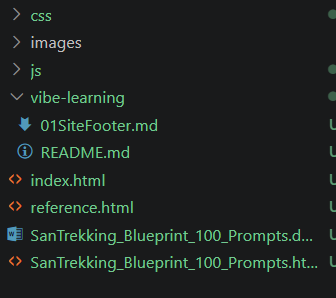

# Vibe Learning : Learn software engineering while vibe coding 

Learn software engineering *while* you vibe code. This marketplace ships one plugin,
**`vibe-learning`**, that turns Claude Code into a tutor riding along with your
coding: after each meaningful change it reads the `git diff` and writes a lesson
into a `vibe-learning/` folder in your project, building a personal curriculum
out of the code you actually shipped.

## What you get

For each change worth learning from, Claude writes (or appends to) a numbered,
topic-named note — e.g. `01Authentication.md`. Every note opens with a
**"Keywords you need to learn"** list, then gives each keyword its own section with
six parts:

1. **Keyword**
2. **What it is (docs)** — the accurate definition, grounded in official docs
3. **First principles** — the same idea stripped to its essence, fewest words
4. **Real-world example** — an analogy plus a small commented sample
5. **Learn it deeply** — a first-party documentation link
6. **In your code** — the actual changed lines, commented, with the file path

You pick your **level** (beginner / intermediate / advanced) and **depth**
(brief / medium / deep) once per project; both are remembered. Trivial edits
(renames, formatting) don't spawn lessons — only changes with something to learn.

Lessons land right inside your project as you build:



## Install

In Claude Code:

```shell
# 1. Add this marketplace
/plugin marketplace add jeevankoiri10/vibe-learning

# 2. Install the plugin
/plugin install vibe-learning@vibe-learning

# 3. Activate without restarting
/reload-plugins
```

(You can also browse it: run `/plugin`, open the **Discover** tab.)

### Already added it before? Refresh first

Claude Code caches a clone of the marketplace, so if you added it previously you
must pull the latest manifest before installing — otherwise you may see
`Failed to install: Source path does not exist`:

```shell
# Re-pull the marketplace, then reinstall
/plugin marketplace update vibe-learning
/plugin install vibe-learning@vibe-learning
/reload-plugins
```

If the error persists, the cached clone is stale. Remove and re-add it:

```shell
/plugin marketplace remove vibe-learning
/plugin marketplace add jeevankoiri10/vibe-learning
/plugin install vibe-learning@vibe-learning
```

## Use it

Start a coding session and say something like:

> "Let's vibe-learn while we build this."

Claude will ask your level and depth the first time, then teach as it codes.
Useful phrases mid-session: `pause vibe learning`, `resume`, `go deeper`,
`explain like I'm a beginner`, `change vibe settings`.

## What's inside

```
vibe-learning/
├── .claude-plugin/
│   └── marketplace.json
└── plugins/
    └── vibe-learning/
        ├── .claude-plugin/
        │   └── plugin.json
        └── skills/
            └── vibe-learning/
                ├── SKILL.md
                └── scripts/
                    └── vibe_lesson.py   # numbering + README indexing helper
```

## A note on trust

Plugins run with your user privileges. This one only reads your `git diff`,
searches the web for documentation links, and writes Markdown files into a
`vibe-learning/` folder in your project — it does not modify your source code.
Read `SKILL.md` and `scripts/vibe_lesson.py` before installing; never install
plugins from sources you don't trust.

## License

MIT — see [LICENSE](LICENSE).

---

## Follow along

[](https://twitter.com/koiri_jeevan/status/2059994698346029091)

> 📢 Read the announcement post on X: [@koiri_jeevan](https://twitter.com/koiri_jeevan/status/2059994698346029091)
